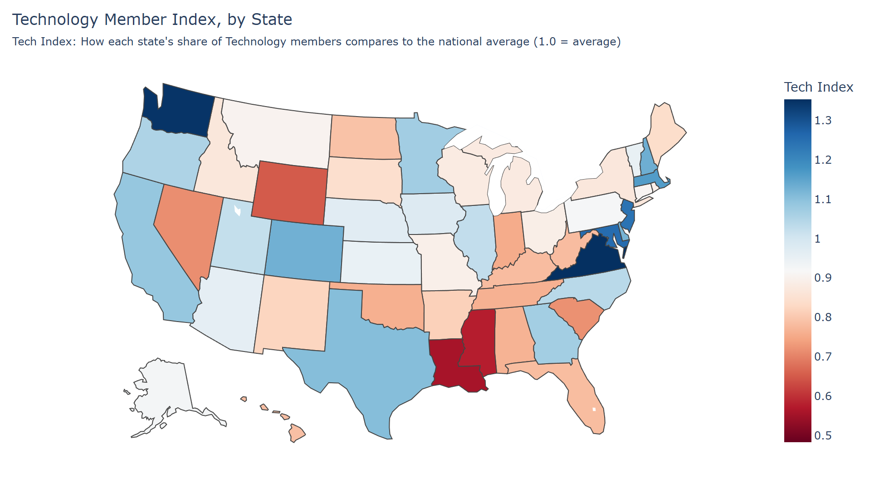

# 📊 User Analytics — U.S. Role Segmentation & Premium Conversion Analysis

This project explores user behavior and job role distribution across a U.S.-based professional platform. Using a large dataset of 7.5 million anonymized users, I analyzed geographic patterns in job roles, segmented tech and project management positions, and investigated upgrade behavior within the first 24 hours of signup.

> Built as part of a data science challenge, this project demonstrates my ability to work with large datasets, engineer meaningful features, and communicate insights visually with Python and interactive HTML exports.

---

## 🔍 Project Highlights

- **Identified the most common job title in each U.S. state**
- **Mapped distribution of tech and project management roles** using choropleth visualizations
- **Calculated and visualized premium conversion rates** within 24 hours of signup across states & roles
- **Exported interactive HTML dashboards** for easy exploration and sharing

---

## 💻 Tools & Libraries

- `pandas`, `numpy` — Data cleaning and manipulation  
- `matplotlib`, `plotly`, `geopandas` — Visualization and mapping  
- `datetime`, `timedelta` — Time delta calculations for user behavior modeling  
- Jupyter Notebook for analysis and HTML export

---

